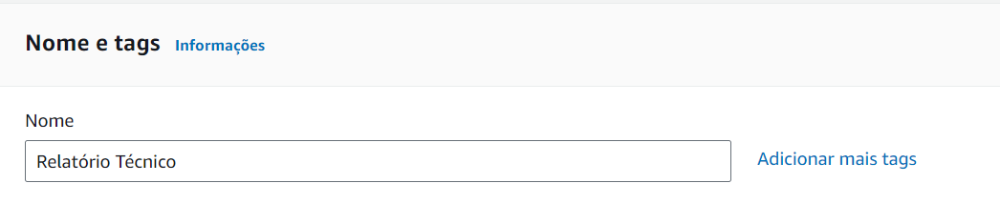

# Relatório Técnico: Criação e Acesso a uma Instância EC2 na AWS via SSH

## Introdução

Este relatório descreve o processo de criação de uma instância EC2 (Elastic Compute Cloud) na AWS (Amazon Web Services) e após isso, o acesso à instância via SSH.

## Objetivo

O objetivo deste projeto é praticar a criação e gerenciamento de uma instância virtual na AWS, além de estabelecer uma conexão segura usando SSH. Isso é essencial para o gerenciamento remoto de servidores na nuvem, permitindo a execução de comandos e a atualização de softwares em um ambiente de produção.

## Materiais

- Conta AWS
- Console de Gerenciamento da AWS
- Windows Subsystem for Linux (WSL)
- Chave privada SSH (arquivo .pem)

## Método

### Criação da Instância EC2

Primeiramente foi acessada a AWS, após isso foi selecionado o serviço EC2. Dentro dele foi criada uma nova instância, seguindo os seguintes passos:

1. **Nome e Tags:** O nome da instância é crucial para identificação e gerenciamento, especialmente quando se trabalha com múltiplas instâncias. Neste caso, o nome escolhido foi "Relatório Técnico". As tags servem para organizar e gerenciar recursos por projeto, departamento ou qualquer outro critério de agrupamento relevante para a infraestrutura em nuvem, nesse caso não foi adicionada nenhuma tag.



2. **Imagens de aplicação e de sistema operacional:** A imagem escolhida foi a `Amazon Linux 2023 AMI`. Esta é uma imagem de sistema operacional baseada no Linux, que é uma escolha comum para servidores web e aplicativos em nuvem.


3. **Tipo de Instância:** O tipo de instância escolhido foi `t2.micro`, que é elegível ao plano gratuito da AWS. Este tipo de instância é suficiente para testes e pequenos projetos, mas para aplicações mais robustas é necessário escolher um tipo de instância mais poderoso.


4. **Par de chaves:** Foi escolhido um par de chaves chamado `raissa` que já estava configurado na minha conta AWS. Este par de chaves é necessário para acessar a instância via SSH. Caso não houvesse um par de chaves disponível, seria necessário criar um novo par de chaves.


5. **Configurações de rede:** A instância foi associada a uma VPC (Virtual Private Cloud) padrão e a uma sub-rede padrão. A VPC é uma rede virtual isolada que pode ser usada para hospedar recursos da AWS. Em relação à grupo de segurança, foi criado um novo grupo de segurança chamado `launch-wizard-2` que permite o acesso à instância via SSH. Foram habilitadas as opções também que permitem tráfego HTTP e HTTPS, para que a instância possa ser usada como servidor web.


6. **Configurar armazenamento:** Foi mantido o armazenamento padrão de 8GB. Este armazenamento é suficiente para testes e pequenos projetos, mas para aplicações mais robustas é necessário aumentar o tamanho do armazenamento.


7. **Executar a instância:** Após configurar todos os detalhes da instância, foi clicado no botão "Executar instância" para criá-la. Após alguns segundos, a instância foi criada e estava pronta para ser acessada.


### Acesso à Instância via SSH

1. **Obter o IP da instância:** Após a instância ser criada, foi obtido o IP público da instância na tela de Instâncias da AWS. Este IP é necessário para acessar a instância via SSH.


2. **Acessar a instância via SSH:** Foi aberto o terminal do WSL e foi executado o seguinte comando para acessar a instância via SSH:
  
```ssh -i ~/raissa.pem ec2-user@34.203.200.142```

Onde `~/raissa.pem` é o caminho para o arquivo de chave privada e `34.203.200.142` é o IP público da instância. O usuário `ec2-user` é o usuário padrão para instâncias Amazon Linux.

Após executar o comando, foi solicitado a confirmação da chave de host. Foi digitado `yes` para confirmar a chave e acessar a instância.

./imagens/image%20(10).png">

Após isso, foi exibida a mensagem de boas-vindas do Amazon Linux, indicando que o acesso à instância foi bem-sucedido.


## Resultados


A criação e o acesso à instância EC2 na AWS foram realizados com sucesso. O processo envolveu a seleção de configurações adequadas para a instância, incluindo o tipo de instância, imagem do sistema operacional, configurações de armazenamento e segurança. A instância t2.micro foi escolhida por estar dentro do plano gratuito da AWS, oferecendo uma solução de custo efetivo para testes e desenvolvimento de pequenos projetos.

Durante a fase de acesso, a utilização da chave privada SSH raissa.pem permitiu uma conexão segura via SSH ao servidor. A confirmação da chave de host e a visualização da mensagem de boas-vindas do Amazon Linux confirmaram que a instância estava operacional e pronta para uso.

## Conclusão

A criação e o acesso a uma instância EC2 na AWS via SSH foram concluídos com sucesso. Este projeto proporcionou uma oportunidade para praticar a criação e gerenciamento de instâncias virtuais na AWS, bem como para estabelecer uma conexão segura usando SSH. Este conhecimento é essencial para o gerenciamento remoto de servidores na nuvem, permitindo a execução de comandos e a atualização de softwares em um ambiente de produção.